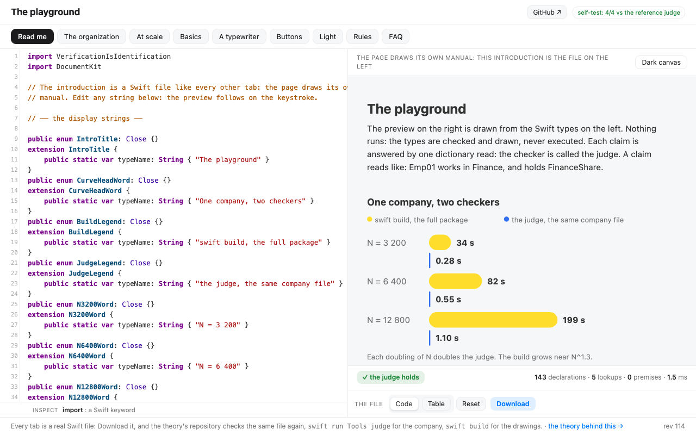

# The playground

Swift types on the left, the page they draw on the right. A checker built on one
dictionary pass, the judge, names every broken claim as you type, and every declared
canvas draws itself: one static page, no build, no server. The one vendored library is
CodeMirror 5 (`codemirror.js`, MIT), the editor pane; everything else is hand-written.
`judge.js`
is a line-for-line port of the Swift judge in the theory's repository, and the badge in
the corner re-runs four recorded verdicts against the port on every load. In CI,
`node check.js` runs the same four plus a fifth: the theory's own world
(`goldens/dynamics-world.swift`) is drawn by the ported renderer and must equal the
recorded `swift run DynamicsDemo draw` byte for byte, and `node check-kit.js` holds
every ported kit name against the theory's sources at a pinned commit.

Live: <https://danielswift1992.github.io/typed-playground/>, or open `index.html` from a
checkout: the page needs its seven files (`index.html`, `judge.js`, `lint.js`,
`renderer.js`, `press.js`, `codemirror.js`, `codemirror.css`) in one folder.

## What to press

- **Read me** (the first tab): the page's own manual, drawn from a Swift file: the
  intro, the measured curve of `swift build` against the judge, and what to try.
- **Hire one more**: a typed employee joins the company and the counted cards follow.
- **Plant a lie**: one alias flips deep in the file, and the judge refuses it by line
  and by name.
- **12 800** (the At scale tab): a generated company of 12,800 people is judged in
  about 0.2 seconds. `swift build` on the same company measures 199.
- **On, Off, and a passcode pad** (the Buttons tab): every key on the canvas is a
  rule declared in the file as three aliases, `Slot`, `From`, `Into`. A press
  rewrites exactly one `typealias` line (`press.js`, a line-for-line port of the
  theory's applier), a mismatch changes nothing, and a key whose rules match twice
  refuses by name.
- **Light** (its own tab): a lamp written as code. The picker mixes the lamp's
  spectral lines one click per level, and the gas itself is one rewritable line:
  hydrogen, neon, or sodium. Every colour on the canvas is computed from the file
  and printed as `color(xyz-d65 …)` for the screen to map, the line weights read
  the CIE 1931 table, and the judge proves metamerism, crossed polarizers, and
  two-slit fringes as type equivalences.
- **Code · Table** (under the preview): the same file read as rows, one row per
  declaration, one column per axis. Nothing is stored: a click on a name opens its
  line, a touch on a state slot offers the rules that can rewrite it.
- **Dark canvas** (beside the canvas): the same declarations under the dark palette.
- Type `func` or `var` anywhere: the law refuses each line, in orange. The rule is §0′
  of the repository's linter: a file declares types and nothing that runs, and the one
  admitted value form is `static var typeName`, a text constant read off the type.

Every tab is a real Swift file: Download it, and the theory's repository checks the
same file again, `swift run Tools judge` for the company, `swift build` for the
drawings.

## The theory

A verdict is an identification: the dictionary is built once, and every claim is one
lookup in it, so a lie planted 136,000 lines deep in the generated company is refused
in milliseconds. The papers, the Swift judge, and the full Swift codebase live at
<https://danielswift1992.github.io/verification-is-identification/>.
